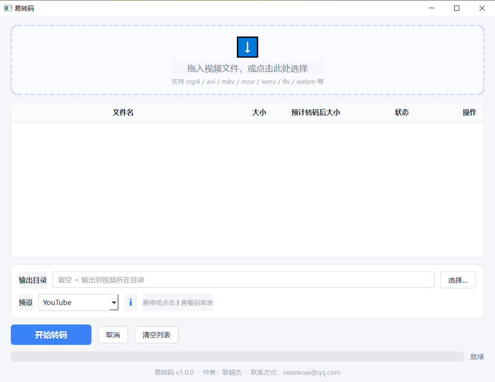

# YiZhuanma (易转码)

> English | [中文](README.md)

A video format conversion tool for Windows: drag in videos and it transcodes
them automatically using YouTube's recommended bitrate table. Uses hardware
encoding when an NVIDIA/AMD/Intel GPU is available, and falls back to CPU
automatically otherwise.

Author: Chaojie Li (黎超杰)  Contact: xxxxwoai@qq.com

## Screenshot



## Features

- Drag & drop or select multiple videos (mp4, avi, mkv, mov, wmv, flv, webm, ts, m4v, etc.)
- Configurable output directory (leave empty = output next to the source video
  as `original-name.mp4`; auto-appends a number when the source is already mp4 to avoid overwriting)
- Preset: YouTube (standard bitrate videos, hover the ℹ icon to see the bitrate table)
- Automatic bitrate matching: picks a tier from the table based on the video's
  short edge and frame rate (H.264 + AAC, MP4 container)
- Automatic encoder selection: h264_nvenc (NVIDIA) → h264_amf (AMD) →
  h264_qsv (Intel iGPU) → libx264 (CPU fallback)
- Falls back to CPU encoding when hardware encoding fails — jobs never abort

## Bitrate Table (YouTube standard bitrate videos)

| Short edge  | ≤30fps video bitrate | >30fps video bitrate | Audio bitrate |
|-------------|----------------------|----------------------|---------------|
| ≤480p       | 800k                 | 1800k                | 128k          |
| ≤720p       | 2200k                | 3200k                | 128k          |
| ≤1080p      | 6000k                | 9000k                | 192k          |
| ≤1440p (2K) | 12000k               | 18000k               | 192k          |
| ≤2160p (4K) | 30000k               | 45000k               | 256k          |

Tier rule: the short edge picks the smallest tier covering the current
resolution (e.g. 900p → 1080p tier); frame rates above 30fps use the
higher-bitrate column.

## Development

```bash
python -m pip install -r requirements.txt
python main.py
```

Requirements: Python 3.11+, and ffmpeg/ffprobe on your machine (during
development it looks in PATH or C:/ffmpeg/bin).

## Building & Distribution

Double-click `build.bat`; the artifact is `dist/易转码.exe` (single file,
no installation, zero dependencies for end users).

Notes:
- The build bundles ffmpeg.exe / ffprobe.exe into the exe
- **For commercial distribution, replace C:/ffmpeg/bin with an LGPL build of
  ffmpeg** (e.g. BtbN's ffmpeg-latest-win64-lgpl) to avoid GPL license
  contamination
- If antivirus software raises false positives, change `--onefile` to
  `--onedir` in build.bat (folder mode has a lower false-positive rate)

## Project Structure

```
main.py              Entry point
yizhuanma/
  __init__.py        Version / author info
  presets.py         YouTube bitrate table + tier selection
  transcoder.py      ffprobe probing, encoder selection, ffmpeg invocation, progress parsing
  ffmpeg_util.py     ffmpeg/ffprobe discovery (dev / packaged)
  ui.py              PySide6 UI (drag & drop, task list, hover bitrate table)
build.bat            PyInstaller build script
```
